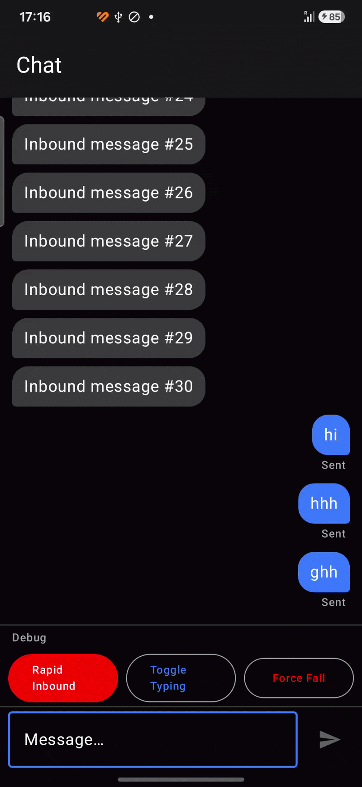
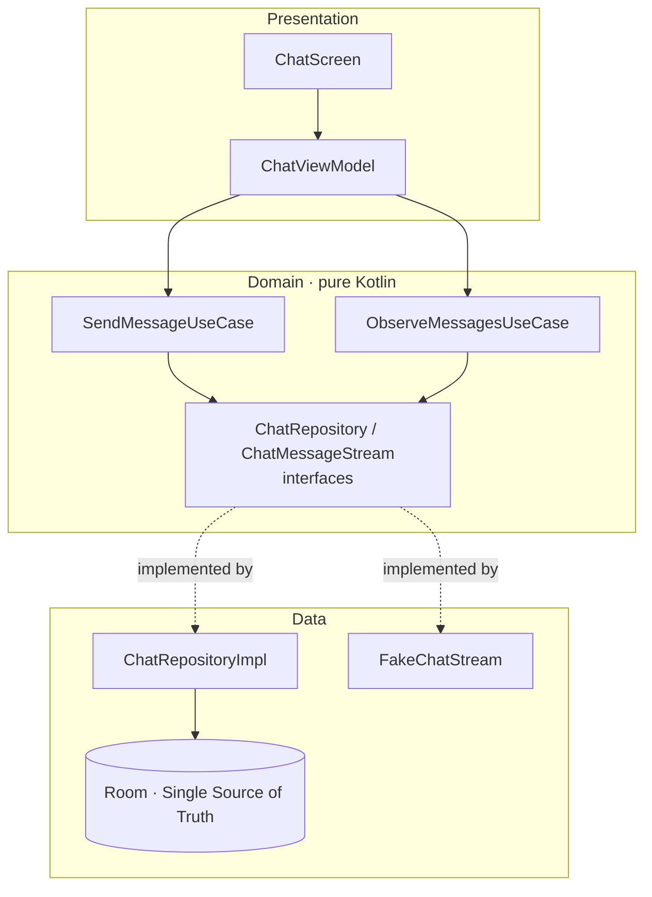
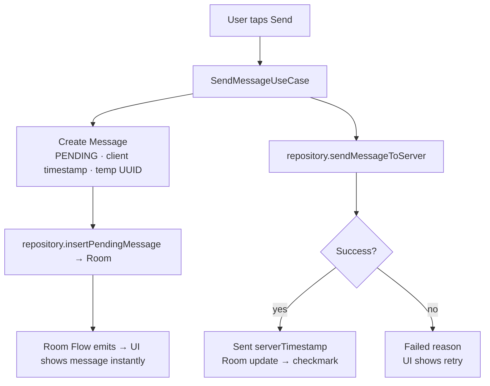

# Real-Time Chat Thread

A single, focused **native Android** chat screen built to demonstrate production-grade thinking around real-time messaging: optimistic UI, provably stable ordering under rapid traffic, a fakeable streaming source, and pure, testable business logic.


> This repo is a deliberately scoped engineering exercise — **one screen, done well** — rather than a full messaging app. The design rationale behind every decision lives in [`docs/Pre-Implementation-Analysis.pdf`](docs/).

---



---

## Table of contents

- [What it does](#what-it-does)
- [Architecture](#architecture)
- [How it works](#how-it-works)
- [Tech stack](#tech-stack)
- [Project structure](#project-structure)
- [Code quality](#code-quality)
- [Getting started](#getting-started)
- [Testing](#testing)
- [Out of scope & roadmap](#out-of-scope--roadmap)
- [License](#license)

---

## What it does

- **Single chat thread** — one focused conversation view.
- **Real-time inbound** — messages arrive from a streaming source while the user is on screen, with a live typing indicator.
- **Optimistic send** — a sent message appears instantly as `PENDING`, becomes `SENT` on success, or `FAILED` with a retry option on error.
- **Stable ordering, always** — no duplicates, no lost or skipped messages, correct sequence even under bursts of rapid inbound traffic.
- **Unidirectional, predictable state** — UI state flows one way.
- **Lifecycle correct** — survives configuration changes (rotation), process death and recreation, and background/foreground transitions.

---

## Architecture

The app follows **UseCase-heavy Clean Architecture + MVVM** across three layers. Dependencies point inward only — outer layers depend on inner abstractions, never the reverse.

| Layer | Responsibility | Key property |
|-------|----------------|--------------|
| **Presentation** | Jetpack Compose UI, a thin `ChatViewModel`, unidirectional `StateFlow<ChatUiState>` and one-shot `SharedFlow<ChatEffect>` | UI-only, no business logic |
| **Domain** | UseCases holding all business rules (`SendMessageUseCase`, `ObserveMessagesUseCase`) plus repository/stream **interfaces** | Pure Kotlin, **zero Android dependencies** |
| **Data** | `ChatRepositoryImpl`, Room (DAO) as the single source of truth, and the `FakeChatStream` implementation | Implements domain contracts |



**Why this shape?** Putting business rules inside UseCases keeps them pure and trivial to unit-test with `runTest` + Turbine — which is what makes stable ordering *provable* rather than merely asserted. The ViewModel stays thin (it only orchestrates), and the streaming source sits behind an interface so it can be faked in tests today and swapped for a real WebSocket later without touching the domain or presentation layers.

---

## How it works

### Optimistic send



The message is written to Room *before* the network call, so the UI updates instantly from the Room `Flow`. The server result then reconciles the same row.

### Reconciliation — same row, no duplicate

On server acknowledgement the existing row is **updated in-place**, never re-inserted. The key insight: the server returns its own permanent ID which differs from the client UUID. Reconciliation uses the **client UUID** (`id`) to find the row, then stores the server's ID in `serverId`. Upserting by the server ID would insert a duplicate row alongside the PENDING one.

| Column | After send (optimistic) | After server ACK | Change |
|--------|------------------------|------------------|--------|
| `id` | `client-uuid-123` | `client-uuid-123` | **No change** — used to locate the row |
| `serverId` | `null` | `srv_abc456` | Filled in — server's permanent ID |
| `content` | "Hey, how are you?" | "Hey, how are you?" | No change |
| `clientTimestamp` | `1000000001` | `1000000001` | No change — ordering stays stable |
| `serverTimestamp` | `null` | `1000000099` | Filled in |
| `status` | `PENDING` | `SENT` | Updated |

Inbound messages from others carry a `serverId` — stored with a unique index in Room — so if the stream reconnects and re-delivers the same message, the upsert overwrites the existing row instead of inserting a duplicate.

### Real-time inbound

Inbound messages never reach the ViewModel or UI directly — **everything flows through Room**:

```
FakeChatStream → ChatRepositoryImpl (parse + map) → chatDao.insertOrUpdate()
              → Room change → ObserveMessagesUseCase emits → Compose updates
```

That single funnel is what makes ordering, de-duplication, and lifecycle behaviour predictable.

### Ordering strategy

Stable ordering is enforced with a client-generated timestamp plus a unique UUID, queried via `ORDER BY timestamp ASC`. Which timestamp wins depends on the sender:

- **Your own messages** → always prefer `clientTimestamp`, even after server confirmation, so a message never jumps position once it appears.
- **Messages from others** → use `serverTimestamp` as the authoritative source of truth.

---

## Tech stack

| Concern | Choice | Why |
|---------|--------|-----|
| Language | **Kotlin** | First-class on Android |
| UI | **Jetpack Compose** | Declarative, lifecycle-aware state with `collectAsStateWithLifecycle()` |
| Async | **Coroutines + Flow** | Structured concurrency, cold & backpressure-aware, first-class in Room/Paging/Retrofit |
| Persistence | **Room** | Reactive single source of truth — reactivity and persistence for free |
| DI | **Hilt** | Google's official DI; trivial test fakes via `@TestInstallIn` |
| Testing | **JUnit · `runTest` · Turbine · MockK** | Deterministic Flow assertions, relaxed mocking |
| Code style | **ktlint** | Enforces consistent Kotlin formatting; Compose-aware via `.editorconfig` |
| Static analysis | **detekt** | Catches complexity, magic numbers, and naming issues; Compose-aware config |

---

## Project structure

Clean + feature-based. Folder colours below map to the architecture layers.

```
app/
├── core/
│   ├── database/
│   ├── di/
│   └── util/
├── feature/chat/
│   ├── data/
│   │   ├── local/
│   │   ├── remote/            # ChatApi placeholder (future WebSocket)
│   │   ├── stream/            # FakeChatStream + ChatMessageStream interface
│   │   ├── repository/
│   │   └── mapper/
│   ├── domain/
│   │   ├── model/
│   │   ├── repository/        # interfaces only
│   │   └── usecase/
│   └── presentation/
│       ├── chat/
│       │   ├── ChatScreen.kt
│       │   ├── ChatViewModel.kt
│       │   ├── ChatUiState.kt
│       │   ├── ChatAction.kt
│       │   └── ChatEffect.kt
│       └── components/
├── MainActivity.kt
└── navigation/
```

The **domain layer has zero Android dependencies** — pure Kotlin, perfect for fast, deterministic unit tests.

---

## Code quality

```bash
# Check formatting
./gradlew ktlintCheck

# Auto-fix formatting
./gradlew ktlintFormat

# Run static analysis
./gradlew detekt
```

ktlint is configured via `.editorconfig` with Compose-aware overrides (PascalCase function names, 120-char line length). detekt config lives in `config/detekt/detekt.yml` with raised thresholds for Composable parameter lists and test files excluded from magic-number rules.

---

## Getting started

### Prerequisites

- Android Studio (latest stable)
- JDK 17+
- Android SDK with a recent API level

### Build & run

```bash
git clone https://github.com/<your-org>/real-time-chat-thread.git
cd real-time-chat-thread

# Build a debug APK
./gradlew assembleDebug

# Or install on a connected device / emulator
./gradlew installDebug
```

Then open the project in Android Studio and run the `app` configuration.

### Try the real-time behaviour

The debug UI includes a **"Rapid Inbound"** button that fires 30 messages in quick succession. Use it to watch ordering stay stable and confirm there are no duplicates — the same property the unit tests assert.

> No backend is required. The app ships with a controllable `FakeChatStream` standing in for a production WebSocket.

---

## Testing

Testing concentrates on the **domain layer**, since the business logic is pure and deterministic. ViewModel tests stay light because it only orchestrates.

```bash
./gradlew test
```

Coverage focuses on:

- **`SendMessageUseCase`** *(highest priority)* — optimistic creation and the full `PENDING → SENT / FAILED` transition sequence.
- **Ordering logic** — stable ordering under rapid inbound traffic.
- **Conflict resolution & de-duplication** — an inbound echo of an optimistic message must not create a duplicate.
- **`ObserveMessagesUseCase`** — Room `Flow` emits the correctly ordered list.
- **`FakeChatStream`** — proven fully controllable for tests and the demo.
- **Reconciliation** — success and failure paths verified with `runTest` + Turbine.
- **Edge cases** — offline send, message burst, failure + retry.

**Goal:** prove stable ordering, optimistic reconciliation, and a fakeable stream with clean unit tests.

---

## Out of scope & roadmap

Deliberately excluded to keep the exercise focused on the hard parts:

- Full chat list / multi-chat navigation
- User authentication or profiles
- End-to-end encryption or message security
- Delivery / read receipts beyond `SENT` / `FAILED`
- Media, voice messages, or rich content
- Full history pagination with `RemoteMediator`
- A real backend or WebSocket server (a controllable fake stream stands in)
- Offline sync with `WorkManager` *(a basic version may be added if time permits)*

The architecture is designed to scale to 40+ screens; the `remote/` placeholder and `ChatMessageStream` interface are the natural seams for adding a real WebSocket and offline sync later.
